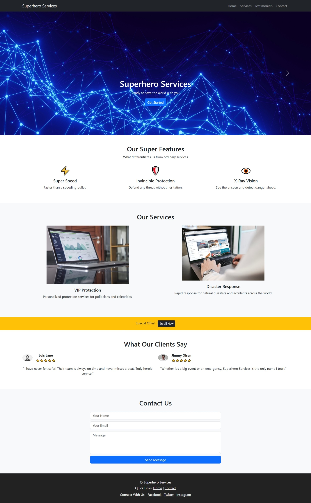

 # Superhero Services Landing Page

A sleek and responsive landing page built with **Bootstrap 5**, designed for a fictional superhero service provider. This project demonstrates layout design, component usage, and interactivity with JavaScript and Bootstrap's carousel.

##  Features

-  Hero carousel with 3 sliding banners
-  Feature highlights section (Super Speed, Invincible Protection, X-Ray Vision)
-  Service cards with images and descriptions
-  Special offer section
-  Testimonials with client images and ratings
-  Contact form with input validation
-  Fully responsive layout

##  Technologies Used

- HTML5
- Bootstrap 5
- CSS (with optional custom styles)
- JavaScript (carousel control)

## Live Demo

[Click here to view the site](https://amanyth155.github.io/Superhero-Services-landing/)

## Screenshot

